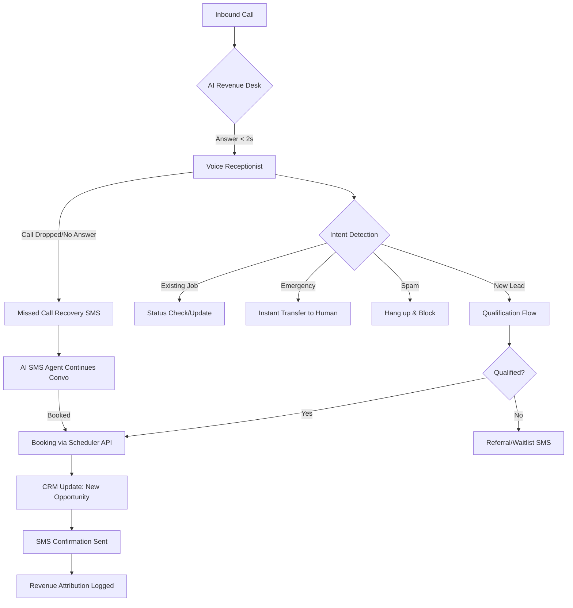

# AI Revenue Desk™ — Technical Architecture

## Infrastructure Stack
*   **Voice Core:** Retell AI (Ultra-low latency, custom LLM-based voice).
*   **Telecom:** Twilio (Programmable Voice + SMS).
*   **Orchestration:** n8n (Self-hosted or Cloud) for complex logic and multi-step integrations.
*   **Intelligence:** OpenAI GPT-4o-mini (for intent extraction) + GPT-4o (for complex scheduling).
*   **Database/Reporting:** BigQuery (for historical data) + Supabase (for real-time dashboard state).
*   **CRM Integration:** Salesforce / ServiceTitan / Housecall Pro via REST API.

## Full Flow Diagram (Logic Path)

## API Call Logic & Webhooks

### 1. Inbound Webhook (Twilio -> Retell)
When a call hits the Twilio number, it is forwarded to a Retell AI Agent.
*   **Action:** `POST https://api.retellai.com/register-call`
*   **Payload:** `{ "agent_id": "REVENUE_DESK_PRIMARY", "from_number": "{{From}}" }`

### 2. Post-Call Analysis (n8n Webhook)
Sent immediately after the call ends.
*   **Endpoint:** `https://n8n.youragency.com/webhook/post-call-analysis`
*   **Properties Extracted:**
    *   `customer_name`: String
    *   `address`: String
    *   `issue_type`: [HVAC, Plumbing, Electrical, etc.]
    *   `urgency`: [Emergency, Standard]
    *   `booked`: Boolean
    *   `appointment_time`: ISO DateTime
    *   `estimated_value`: Number (based on issue type)

## Data Schema (Tracking)

| Table: `ai_events` | Type | Description |
| :--- | :--- | :--- |
| `event_id` | UUID | Unique ID |
| `call_sid` | String | Twilio Reference |
| `customer_phone` | String | E.164 Format |
| `intent` | String | extracted intent (e.g. "ac_repair") |
| `status` | String | [booked, qualified_not_booked, missed_recovered, abandoned] |
| `rev_potential` | Decimal | $ value of typical job type |
| `timestamp` | DateTime | Event time |

## Failover & Logic Layers

### 1. Failover Logic
If Retell API returns anything other than `200 OK`, Twilio falls back to a **Standard Voicemail Greeting** + **Instant SMS Alert** to the owner: *"Our AI is currently busy, we're texting the customer now."*

### 2. Human Escalation Triggers
*   "I need to speak to a manager."
*   "Is this a robot?" (If asked > 2 times)
*   Keywords: "Lawsuit", "Police", "Bursting", "Fire".
*   **Action:** `dial` verb in TwiML to the office landline.

### 3. SMS Retry Logic
*   **Sequence 1:** T+0 (Missed Call Recovery - Brand Intro)
*   **Sequence 2:** T+5m (Follow up if no reply)
*   **Sequence 3:** T+24h (Last chance offer)

## Version Control Notes
*   **Voice Scripts:** Managed in GitHub repo under `/prompts/voice/v1.2.json`.
*   **Prompt Engineering:** Versioning handled by LangSmith for tracing and optimization.
